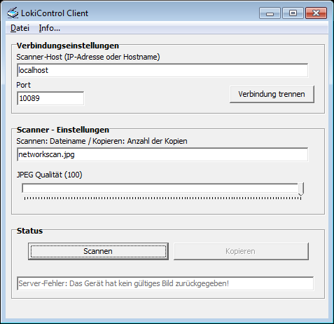

LokiControl
===========

This is an application that makes it possible for multiple clients to use a
scanner that is connected to a server. It was written in 2005 when I first
tried out Borland Delphi. Due to its age the server only works with TWAIN
enabled scanner drivers. Since Windows does not use the TWAIN API anymore this
code has mostly historic and sentimental value.

This was the first application I wrote that was used by a couple of people.
